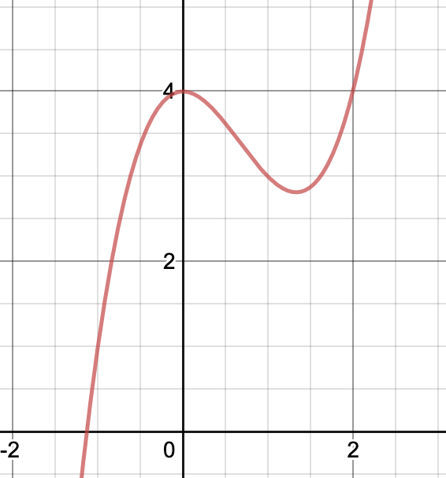

# oak
**A command-line desktop calculator for Unix**

oak exists because

- `dc` is too cryptic and doesn't use readline
- `bc` and similar programs use infix notation, not RPN
- `apl` is all that, and requires a special keyboard too

oak borrows a little from all these as well as Forth and PostScript.

## Installation
Clone the repo and run `make oak`.

The following targets are defined in the Makefile:

	- oak          make and install the binary
	- lint         run golangci-lint (must be installed)
	- test         run go test -v -cover
	- demo         make oak and run the demo
	- demo-test    run the demo, compare to expected output
	- clean        clean up build/test stuff

TODO - allow oak to be downloaded with `go get` (but we need the version to be set correctly)

## Usage
oak simulates a classic stack-based RPN calculator [RPN -- reverse Polish notation -- is also known as postfix notation]. 
Numbers are pushed onto a stack, and operators take the top item (or top two items) and leave a result on top of the stack.

For example

	$ oak
	> 2 3 +
	1: 5
	> 2 pi 3 sqr * *
	2: 56.54867

where the second example is `2 * pi * r^2` for `r=3`: the area of a circle with radius 3.

oak uses readline in interactive mode, allowing prior input lines to be recalled and edited.

Variables in the form `$n` allow re-use of prior results (`$4` recalls the fourth result in the session). 

A special variable `$0` acts as the "last x" operator, recalling the top-of-stack value from the last operation. 
For example

	> 4 sqrt
	1: 2
	> $0 +   # where $0 in this case is 4
	2: 6

Note that the result of the previous calculation remains on top of the stack, e.g.,

	> 2 1 +
	1: 3
	> 1 +
	2: 4

### The stack
It is common to label the four topmost stack items using the letters _x_, _y_, _z_, and _w_ (where _x_ resides on top of the stack); these are sometimes called _registers_ in the literature (for calculators with a limited stack size). 

We use this notation below to explain how operators are taken from the stack and results pushed back. However, use of these four named registers in the examples does not indicate the stack is limited to four items; it is actually unlimited.

There is an additional register known as "last x" which holds the last _x_ value popped off the stack to be used as an operand. It is not part of the stack, and is accessible through the result variable `$0` (more below).

At present, oak does not support using a "bottom-of-stack" _t_ register whose contents are propagated upwards due to stack lift (used to provide a conveniently reusable constant in calculations); it doesn't seem necessary in a command-line calculator.

### Numbers
Decimal numbers (when the base is 10, which is the default) are evaluated as 64-bit floating point numbers, e.g.

	1
	1.
	.1
	-1
	-0.1
	1.1e+3
	1e-3

When the base is set to an integer mode (binary, octal, hexadecimal) numbers are evaluated as unsigned integers (up to 64 bits) and may be written with 0[bB] or 0[xX] prefixes if desired, e.g.

	0b10010001
	0177
	0x283e
	101

Note that integers without a leading 0 will be interpreted as base 10 integer values. See more below.

A number is always pushed onto the top of the stack immediately.

### Strings
A few commands take a string argument (e.g., mode), entered with double qoutes; these values are immediately pushed onto the stack. For example,

	> "rad" mode
	1: <nil>
	> 0.524 sin
	2: 0.500

TODO - consider operations on strings as data

### Display
There are three explicit display modes for floating-point values:

- fixed point
- scientific notation
- engineering notation (scientific, but exponents are always multple of 3)

These can be set from the command line of by commands (see below).
oak uses Go's default floating point representation if no display mode is set.

For example:

	> 3 recp
	1: 0.3333333333333333
	> 3 fix
	2: 0.333
	> 3 sci
	3: 3.333e-01
	> 3 eng
	4: 0.333e+00
	> 10 *
	5: 3.333e+00
	> 100 *
	6: 0.333e+03

### Modes

#### Angular mode
By default, trigonometry functions evaluate their arguments in degrees; the mode may be changed to radians (see "mode" and the degree/radians conversion operators below). For example,

	> 30 sin
	1: 0.500
	> 30 rad
	2: 0.524
	> sin
	3: 0.500

#### Base (radix)
By default, the calculator operates in base-10 floating point mode, but may be changed to an integer mode (see "base" below). 

Changing the base to binary, octal, or hexadecimal has these effects:

- input numbers are taken to be unsigned integers, with these options:
    - a `0[bB]` prefix indicates binary
    - a `0[xX]` prefix indicates hexadecimal
    - numbers with a leading 0 will be taken as octal (e.g., 0177 is decimal 127)
- the output of integers is formatted in the correct base; e.g. with a `0x` prefix for hexadecimal numbers

If the base was changed by a conversion command ("bin", "oct", or "hex"):

- the top of stack will be converted to an unsigned integer (truncated) when the base is changed to binary/octal/hex
- other numbers (deeper in the stack) remain as floating point numbers unless disturbed, and will retain their full values
  if the mode is changed back

For example

    $ oak
    > oct 127   # could have been "127 oct" also
    1: 0177
    > 234
    2: 0352
    > +
    3: 0551
    > dec
    4: 361

All math is integer math while the base is not decimal, and so any operation involving a floating point number may cause 
it to be truncated.

Truncated numbers are not restored when switching back to decimal.

For example

	$ oak
	> 2.3 8 base
	1: 2.3
	> dec
	2: 2.3
	> 3+
	3: 5.3
	> 8 base
	4: 5.3
	> 2+
	5: 007
	> dec
	6: 7

versus

	$ oak
	> 7 3.3 hex
	1: 0x0003
	> +
	2: 0x000a
	> dec
	3: 10

Binary numbers display at a minimum 8 bits, octal 3 digits (plus leading zero), and hexadecimal 4 digits.

There will be no support for converting floating point numbers into their equivalent unsigned integer form and vice 
versa (i.e., for debugging IEEE formats).

### Variables
Variables have two forms

- "Result" variables in the form $1, $2, etc., auto-generated by evaluation (each name is the number of a result line)

	For example
	
		> 1 2 +
		1: 3
		> $1
		2: 3
		> +
		3: 6
		> 1 $3 +
		4: 7

	where `$0` is a special case representing the "last x" value.

	A result variable name in the input causes its value to be pushed onto the stack. Result variables are automatically defined as results are printed (that is, line by line) and cannot be modified by a store operation.	
		
- User-defined variables with alphanumeric names (not starting with a digit), for example `$name`

	User-defined variables must be created by a store (`!`) operation and deferenced by a recall (`@`) operation; their values are **not** immediately pushed as in the case of result variables.

	For example,
	
		> 1 2 +
		1: 3
		> $name !
		2: <nil>
		> 2 $name @+
		3: 5
		> $name@+
		4: 8

	There is no way to delete user-defined variables at this time.

## Operations

oak offers the following floating-point binary operators:

	+      {y,x} -> x = y+x
	-      {y,x} -> x = y-x
	*      {y,x} -> x = y*x
	/      {y,x} -> x = y/x
	%      {y,x} -> x = y mod x
	**     {y,x} -> x = y to the power x
	
	∑+     {y,x} -> y=y, x=n++           [add stats data point]
	∑-     {y,x} -> y=y, x=n--           [delete stats data point]

and these bitwise operations for unsigned integers:

	&      {y,x} -> x = y&x              [bitwise and]
	|      {y,x} -> x = y|x              [bitwise or]
	^      {y,x} -> x = y^x              [bitwise xor]
	<<     {y,x} -> x = y<<x             [left shift]
	>>     {y,x} -> x = y>>x             [logical right shift]
	>>>    {y,x} -> x = y>>>x            [arithmetic right shift]

	~      {x}   -> x = !x               [bitwise not]

along with the following floating-point unary functions, which replace the top of stack with a new value

	abs    absolute value
	acos   arccos (inverse cos)
	asin   arcsin (inverse sin)
	atan   arctan (inverse tan)
	cbrt   cube root (x ** 1/3)
	ceil   ceiling
	chs    change sign
	cos    cosine
	cube   cube (x ** 3)
	exp    e ** x
	fact   factorial [using gamma(x+1)]
	floor  floor
	frac   return the fractional part of the number
	ln     natural log
	log    log in base 10
	pow    10 ** x
	recp   reciprocal [1/x]
	sin    sine
	sqr    square (x ** 2)
	sqrt   square root (x ** 1/2)
	tan    tangent
	trunc  truncate

and these floating-point binary functions (some save the _y_ register)

	dist   {y,x} -> x = sqrt(x**2 + y**2)
	dperc  {y,x} -> y=y, x = (x-y)/y * 100 [percent change from y to x]
	max    {y,x} -> x = max(x,y)
	min    {y,x} -> x = min(x,y)
	perc   {y,x} -> y=y, x = y*x / 100     [x percent of y]

and these statistics functions

	sum    {y,x} -> y=y, x=n++  [n = # of data pts, same as ∑+]
	
	mean   push y = mean(y), x = mean(x)
	stdev  push y = stdev(y), x = stdev(x)    [sample std dev]
	sterr  push y = stderr(y), x = stderr(x)  [std error of mean]
	line   push y = slope, x = intercept

	estm   {x}   -> push y = corr coefficient, x = estimated y
	
	comb   {y,x} -> x = combinations of y items x at a time
	perm   {y,x} -> x = permutations of y items x at a time

along with these advance math functions taking a word as a function

	integr calculate the definite integral of the function (word) x from a to b
	       {a,b,x} -> x      [a,b are in the z,y registers]
	solve  find a root of the function (word) x in the interval [a,b]
	       {a,b,x} -> x      [a,b are in the z,y registers]
	ddx    differentiate the function (word) x at the point y
	       {y,x}   -> x
	
	gaussl calculate the definite integral using Gauss-Legendre
	rombrg calculate the definite integral using Romberg (possibly adapted)

and these bitwise unary functions

	maskl  {x}   -> x = ^0 << (64-x), ^0 if x > 64  [left mask]
	maskr  {x}   -> x = ^0 >> (64-x), ^0 if x > 64  [right mask]
	popcnt {x}   -> x = population count of x (# of 1 bits)

and these unary functions on user variables (e.g., `$a`)

	!      {y,x} -> {}, vars[x]=y        [store]
	@      {x}   -> x = vars[x]          [recall]

as well as these operations on the stack / machine

	clr    reset top of stack (x register) to 0
	clrall reset everything: stack, last x, variables
	clrreg reset all non-stack registers (for now, "last x")
	       along with the statistics accumulating registers
	clrstk reset the entire stack to empty along with the
	       statistics accumulating registers
	clrvar reset the variable memory (both user-defined and 
	       results variables)
	depth  push the existing stack depth onto it
	       {w,z,y,x} -> {z,y,x,#}
	dump   display the stack & variables, leave stack unchanged
	       (very primitive debugging tool ;-)
	drop   pop the top of stack
	       {w,z,y,x} -> {w,z,y}
	dup    duplicate the top of stack
	       {w,z,y,x} -> {z,y,x,x}
	dup2   duplicate the top two stack items in order
	       {w,z,y,x} -> {y,x,y,x}
	eng    pop the top of stack and set engineering notation
	       (scientific notation, but exponents are multiples of 3)
	fix    pop the top of stack and set fixed precision
	load   pop a string off the stack and read the machine's
	       state from that file; overwrites the current state
	over   duplicate the second-from-top item onto the stack
	       {w,z,y,x} -> {z,y,x,y}
	roll   roll the top of stack to the bottom
	       {w,z,y,x} -> {x,w,z,y}
	save   pop a string off the stack and save the machine's
	       state into that file (for use with load or -i option)
	sci    pop the top of stack and set scientific format
	status display current modes; leaves stack unchanged
	swap   swap the top two items
	       {w,z,y,x} -> {w,z,x,y}
	top    causes the top of stack to be the result
	       (a blank line does the same thing)

and these mode/conversion operations

	mode   pop the top of stack and set the trigonometry mode
	       {"deg","rad"} (default degrees)

	deg    convert radians to degrees (and change the mode)
	rad    convert degrees to radians (and change the mode)

	base   pop the top of stack and set base {2,8,10,16}
	       (default 10)

	bin    convert to integer, set base 2
	oct    convert to integer, set base 8
	hex    convert to integer, set base 16
	dec    convert to normal (floating point) mode, base 10

and finally these constants

	e      base of natural logarithms, 2.71828
	pi     ratio of diameter to circumference, 3.14159
	phi    the "golden" ratio, 1.61803

There is also a single punctuation mark, where the comma (`,`) is used to separate lines of input (e.g., when using the
 `-e` option, below).

The pound sign (``#``) is used to start a comment that extends to the end of the line.

## Saved state
If you save the state of the machine with "save", that state includes

- the stack
- the "last x" value
- all user-defined variables (but not result variables)
- all user-defined words
- the stats registers, if defined
- the angular mode, display mode & digits, and base

Loading state with "load" overwrites all existing machine state except result variables.

## User-defined functions (words)
oak allows the user to define simple words using a Forth-like syntax, for example:

	: name op op ... ;

where the name may then be used as a function operating against the stack. The name must be a valid identifier (not a number) and the definition must include at least one operation (even if that is just a number, such as a word defining a new constant).

By "simple" we mean that there is not yet any way to specify conditional logic or iteration; the operations in the definition will be executed sequentially. 
As such, user-defined words are essentially macros.
Note that there is no declaration of the numbers or types of parameters, nor any embedded comment.

In interactive mode (using readline), the entire macro definition must fit on one line.

The word definition may include references to user-defined variables. These are not checked until the word is executed, so runtime errors may occur if one is not defined in the machine then.

Also, user-defined words are not allowed to reference result variables (e.g., `$1`) in their definitions, as these only exist on a per-session basis.

For example, we can create a macro to calculate decibels (dB)

	> :dB log 10*;
	1: <nil>
	> 4 dB
	2: 6.021

Note that we can create and use a definition on the same line, as in

	> :dB log 10*; 4 dB
	1: 6.021

Also, a word may be used as a symbol by prefixing it with a dollar sign `$`. This is necessary when using a word as an argument to another operation, such as the advanced math operations (see below).

## Statistics operations
oak can calculate basic statistics on one or two variables, as well as perform linear regression and calculate the correlation coefficient.

The `sum` command is used to enter data points one at a time (or one pair of y,x values). Each invocation of `sum` leaves _n_ (the number of data points) in the _x_ register and _y_ unchanged.

As an alternative, you can use the operators `∑+` (`sum`) and `∑-` (where the latter removes a data point; there is no similar named function).

Given some number of data points, `mean` calculates the mean (average) and `stdev` the _sample_ standard deviation.

Given some number of data points in two variables, `line` calculates the linear regression _y = ax+b_, leaving the intercept _b_ in the _x_ register and the slope _a_ in the _y_ register.

Given some number of data points in two variables, `estm` calculates an estimated _y_ value for a given _x_, leaving the estimated _y_ in the x register, and the correlation coefficient _r_ in the _y_ register (yes, we know it's confusing :-).

The functions `mean`, `stdev`, `sterr`, `line`, and `estm` push new {y,x} pairs onto the stack (older data on the stack is pushed underneath). Note that of these functions only `estm` takes a value from the stack (the input _x_ value).

For example, given the following problem

| N, kg/hectare (x) | Yield, tons (y) |
| ----------------- | --------------- |
| 0                 | 4.6             |
| 20                | 5.78            |
| 40                | 6.61            |
| 60                | 7.21            |
| 70                | 7.78            |

we enter it as

	> 4.63  0 sum
	1: 1.00
	> 5.78 20 sum
	2: 2.00
	> 6.61 40 sum
	3: 3.00
	> 7.21 60 sum
	4: 4.00
	> 7.78 80 sum
	5: 5.00

from which we may calculate

	> mean
	6: 40.00
	> swap
	7: 6.40
	> stdev
	8: 31.62
	> swap
	9: 1.24

with means for {x,y} of 40 and 6.48, respectively, and standard deviations of 31.62 and 1.24.

For linear regression we may calculate

	> line
	10: 4.86
	> swap
	11: 0.04
	> 70 estm
	12: 7.56
	> swap
	13: 0.99

giving us _y = 0.04x + 4.86_ as the line, and an estimated _y_ of 7.56 given a new value _x = 70_, with a correlation coefficient of _r = 0.99_.

Using any of these statistics functions without having entered any data points will yield an error.

The statistics are calculated from separate statistics registers which are cleared by `clrreg`, `clrstk`, or `clrall` (using `clrstk` is recommended before entering data points to avoid picking up any old data from the stack).

The statitics registers used to sum these variables may be accessed as variables (using these register names for historical reasons):

	$r_2   n (count of data points)
	$r_3   ∑ x
	$r_4   ∑ x**2
	$r_5   ∑ y
	$r_6   ∑ y**2
	$r_7   ∑ xy

These special variables only exist when the statistic registers have data. They are read-only, so they can be read with `@` but not written with `!`.

## Advanced mathematics
oak can calculate numerical derivatives and integrals and find roots of a function. For details of the algorithms used, see *Numerical Analysis, third ed.* by Timothy Sauer (ISBN [9780134696454](https://www.amazon.com/Numerical-Analysis-3rd-Timothy-Sauer/dp/013469645X)).

Each of these methods takes a word representing a function and one or two numbers. In all cases, the given word represents a real-valued function in one variable. It will be given a value on the stack and be expected to return its result on the stack.

These operations leave the "last x" register unchanged.

### Derivatives
The function `ddx` will calculate the derivative `f'(x)` of a function `f` represented as a word using a three-point finite-difference approximation [*Sauer* §5.1], with *h* = 1e-5.

For example, given `f(x) = e**x`, calculate the derivative at 0 and 1

	> 5 fix :f exp;
	1: <nil>
	> 0 $f ddx
	2: 1.00000
	> 1 $f ddx
	3: 2.71828

Similarly, `d2dx` calculates the 2nd derivative `f''(x)` using a five-point finite difference scheme with *h* = 1e-3.

For example, 

	> 8 fix :f exp;
	1: <nil>
	> 1 $f d2dx
	2: 2.71828183
	> :g recp;
	3: 2.71828183
	> 2 $g d2dx
	4: 0.25000000

### Integrals
The function `integr` will calculate the definite integral of a function `f(x)` between two values *a* and *b* (assuming *a < b*). It uses Gaussian quadrature with a 7th-order Legendre polynomial over [-1,1] by adapting the original function [*Sauer* §5.5]. If that fails, it uses Romberg integration [*Sauer* §5.3] with a hack if needed to attempt to handle integrals which are improper at one endpoint or the other.

For example, given `f(x) = e**x`, calculate the definite integral over [0,2]

	> :f exp;
	1: <nil>
	> 0 2 $f integr
	2: 6.389056098930648
	> 2 exp 1-
	3: 6.38905609893065

where the value of the integral is `e**2 - 1` (shown for comparison).

The lower bound of the interval must always be pushed onto the stack first, followed by the upper bound and then the word.

**NOTE** that the results may be quite off for improper integrals or functions which oscillate wildly in the given interval. Unfortunately, it's just not possible for a calculator to handle all cases, and indeed the user should understand the problem being posed and not blindly trust the machine. See William Kahan's great article "Handheld calculator evaluates integrals", [*Hewlett-Packard Journal* 31:8](https://www.hpl.hp.com/hpjournal/pdfs/IssuePDFs/1980-08.pdf) (Aug 1980), pp. 23-32.

The two methods may be used by themselves by invoking `gaussl` or `rombrg` in exactly the same way; it is the Gaussian procedure which will most likely report an error if it considers the integral to be improper.

For example, the logarithm and reciprocal functions starting at 0 are improper:

	> :f ln;
	1: <nil>
	> 0 1 $f gaussl
	improper integral
	> 0 1 $f rombrg
	3: -1.0000005786329074
	> 5 fix
	4: -1.00000
	> :g recp;
	5: -1.00000
	> 0 1 $g gaussl
	improper integral
	> 0 1 $g rombrg
	7: 36308168.95462

where the last result is headed to +Inf.

The Romberg method will run until the difference between successive estimates is less than *eps* = 1e-15 (or until it runs over a fixed limit on the number of iterations allowed, currently 24).

### Root finding
The function `solve` takes a function `f(x)` represented as a word as well as an interval [a, b] and attempts to find a root within that interval.

It uses two methods, the secant method [*Sauer* §1.5] and, if that is not successful, the Newton-Raphson method [*Sauer* §1.4]. Either one may fail for certain cases (for example, Newton's method may oscillate between two roots without converging), but one of them should work in most cases. 

Both methods iterate until the difference between two successive estimates is less than *eps* = 1e-15 (or until they run over a fixed limit on the number of iterations allowed, currently 100).

If no root is found within the given interval, `solve` will return "no solution".

For example, given the function `f(x) = x**2 + x - 1`, find a root between 0 and 2

	> :g dup sqr + 1-;
	1: <nil>
	> 2 g
	2: 5
	> 3 g
	3: 11
	> 0 2 $g solve
	4: 0.6180339887498949
	> -1 0 $g solve
	no solution
	> -3 -1 $g solve
	5: -1.618033988749895

The lower bound of the interval must always be pushed onto the stack first, followed by the upper bound and then the word.

**NOTE** that sometimes this method will fail to find a solution within the interval if it is attracted to another root nearby. This happens in the example when we use the interval [-5, 0], but not when we exclude 0 (as with the interval [-3, -1]).

	> -5 0 $g solve
	no solution

See also William Kahan's article "Personal calculator has key to solve any equation f(x) = 0", [*Hewlett-Packard Journal* 30:12](https://www.hpl.hp.com/hpjournal/pdfs/IssuePDFs/1979-12.pdf) (Dec 1979), pp. 20-26.

Also note that we can solve for roots of a function of a function, such as the derivatve. For example, given `f(x) = x^3 - 2x^2 + 4` where `g(x) = f'(x)` and `h(x) = f''(x)`

	

we can find the maximum, minimum, and inflection point:

	> :f dup dup sqr* swap sqr 2*- 4+;
	1: <nil>
	> :g $f ddx;
	2: <nil>
	> -0.5 0.5 $g solve
	3: 0.000
	> 1 2 $g solve
	4: 1.333
	> :h $f d2dx;
	5: 1.333
	> 0 1 $h solve
	6: 0.667

## Functions on strings
TODO

## Vector operations
TODO

## Command-line options
oak has only a few options

	-e <input>  read input from the command line
	-f <file>   read input from a file
	-c <file>   use this file for initial configuration
	            (in place of `~/.oak.yml`)
	-i <file>   load a stored machine image from a file
	            (this creates a non-empty initial state)

	-fix <num>  set fixed precison to <num> digits (e.g., %.3f)
	-sci <num>  set scientific format to <num> digits (e.g., %.3e)
	-eng <num>  like scientific format, but exponents are multiples
	            of 3 only

	-rad        start in radians mode for trigonometry
	-debug      show how the line parses for debugging
	-demo       run in demo mode, only works with -f
	            (print each input line before the output)

For example,

	$ oak -e '1 2 +, 3+'
	1: 3
	2: 6
	$ oak -e '127 bin, oct, hex'
	1: 0b01111111
	2: 0177
	3: 0x007f

If neither `-e` nor `-f` is present (the former takes precedence), oak starts an interactive REPL. Exit with "bye" or type ctrl-D.

If the display or angular modes are set from the command line, these values override the options in `.oak.yml` (see below) or in any stored machine image loaded with `-i`.

Demo mode ignores all command-line options except `-f` (which must be set) as well as any local configuration in `.oak.yml`.

## History
The REPL stores up to 50 lines of command history in `$HOME/.oakhist` which is available to your next session (through the normal operations at the prompt, e.g., up-arrow).

## Startup configuration
The machine will read the file `$HOME/.oak.yml` if it is present. The file may have both options and commands. For example,

	options:
	  trig_mode: "rad"
	  display_mode: fix
	  digits: 3
	commands:
	  - status 

then the REPL will display the new status before the first input line:

	$ oak
	base: 10 mode: rad display: fix/3
	>

The possible options are

	trig_mode        "deg" or "rad"
	display_mode     "free", "fix", "sci", "eng"
	base             10, 2, 8, 16
	digits           2, 0+

where the first value is the default in each case.

The list of commands is joined with "," and processed as a unit.
Thus

	commands:
	  - 1 2
	  - 3+
	  - sqr

is equivalent to `1 2, 3+, sqr`.

Note that the commands in the `.oak.yml` file do not leave result variables or a "last x" value when the machine starts. There will be no output unless an error occurs, in which case the machine will print the error and quit.

Also, certain command-line options override the options set in the configuration file (see above).

## To do
Here are a few possible enhancements:

- vector operations
- string functions (really?)
- logic & iteration in user-defined words
- allow user-defined variables to be deleted
- interest-rate calculations, similar to the HP 12c
- add support for complex numbers and their functions (e.g, tanh)
- oh, and we need a circular slide rule mode of operation, too ;-)

## Known Bugs
There are no known issues.

Code coverage is hovering around 70% (still need better coverage of error paths).
